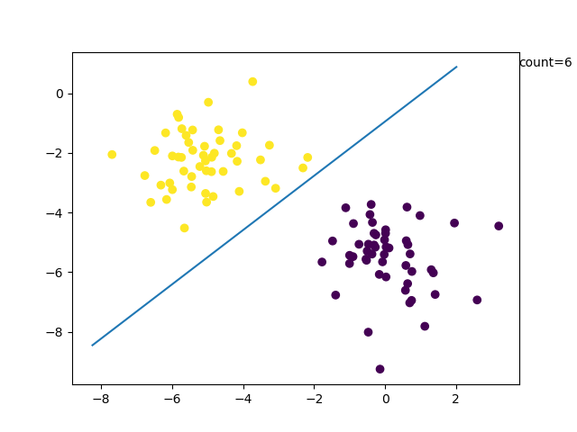

# 实验一 Perceptron Learning toward Linear Classification 
>实验者:timfan  
>[报告地址](https://github.com/timfaner/2018_PR_Experiment/blob/master/report/exp_1.md) : (https://github.com/timfaner/2018_PR_Experiment/blob/master/report/exp_1.md)
>代码地址 : [Github](https://github.com/timfaner/2018_PR_Experiment/tree/master/exp_1)

## 实验原理

## 实验代码

### W更新部分
``` python
old_W = W.copy()
for position,x in enumerate(DATA_SET):
    X = np.hstack((x,base))
    #print('input x is {}'.format(X))
    chg = 1 if LABEL[position] else -1
    temp = np.dot(W,X) * chg
    if temp > 0:
        pass
    elif temp <= 0:
        #update
        W = W + nita*X*chg
        break
if (old_W == W):print('迭代成功')
```
### 生成数据集
使用 `scilearn-kit`生成数据集
``` python
DATA_SET,LABEL = dataset.make_blobs(n_samples=70,centers=2,random_state=50)
```

## 实验结果

### 样本数100，学习率0.5
  
可以看到收敛次数为6
### 样本数100，学习率0.2
  
可以看到收敛次数为2  
### 观察不同收敛速率

  
样本数100，学习率0.05  
  
样本数100，学习率0.01     

可以看到收敛速率越大收敛越快

### 收敛速率与迭代次数关系

  
  
观察发现迭代次数随着学习率提升而降低