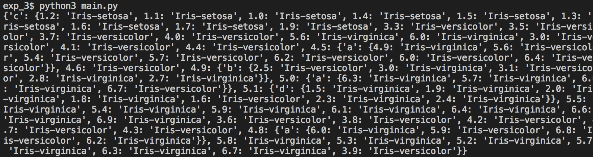

# 实验二 Decision Tree Learning for Classification
>实验者:timfan  
>[报告地址](https://github.com/timfaner/2018_PR_Experiment/blob/master/report/exp_2.md) : (https://github.com/timfaner/2018_PR_Experiment/blob/master/report/exp_2.md)
>代码地址 : [Github](https://github.com/timfaner/2018_PR_Experiment/tree/master/exp_2)

## 实验原理

## 实验目标

### 1.1 计算每个属性的信息熵

``` python
def calcAttributeShannonEnt(dataSet):
    numFeatures = len(dataSet[0]) - 1          	 attribute_information_list =[]
    for i in range(numFeatures):                
    featList = [example[i] for example in dataSet]
    uniqueVals = set(featList) 
    newEntropy = 0.0
    for value in uniqueVals:
        subDataSet = splitDataSet(dataSet, i, value)
        prob = len(subDataSet)/float(len(dataSet))
        newEntropy += prob * calcShannonEnt(subDataSet)
        newIV -= prob/log(prob,2)        
    attribute_information_list.append(newEntropy)
    
    return attribute_information_list,iv_list
```  


`Iris Dataset from the UCI Machine Learning Repository` 数据集，得到结果   
```[0.7080248, 
1.068319625, 0.13864597, 0.14906466204], ....```

### 1.2 挑选区分能力最强属性
```python
atr_l,iv_l = calcAttributeShannonEnt(data_set) #计算属性信息熵和属性标准IV
gain_list = []
gain_ratio_list = []
baseE = calcShannonEnt(data_set)
sumE = 0
for i in range(len(atr_l)):
    gain_list.append(baseE-atr_l[i])
    #计算信息增益
    gain_ratio_list.append((baseE-atr_l[i])/iv_l[i])
    #计算信息增益率
    sumE += atrE
avrE = sumE/len(atr_l)

index_list = []
for i in range(len(atr_l)):
    if atr_l[i] >= avrE:
        index_list.append(i)

av_gr_dict = {index:gain_ratio_list[index] for index in index_list}

max_gr = 0;attr_index = -1
for index,value in av_gr_dict.items():
    if value > max_gr:
        max_gr = value;attr_index = index
#先从候选属性中找出信息增益高于平均水平的属性
#再从中选择增益率最高的，并返回索引号

```

得到结果 `2` 即第三组标签

###1.3 建立树并用恰当方式数据结构表示
在python中可以使用字典来储存决策树，词典中键为属性，值为该属性不同子集下的树。  
树的建立可理解为递归的过程，分类-建立树-剩下的数据集分类-建立树。。。以此类推。递归中止条件：被分类的数据集只有一个属性，或被分类的数据全都是相同类别。需要注意的是当数据集只有一个属性，其对应类别可简单处理为该数据集最多的类别。代码如下：  

```python
def createTree(dataSet,labels):
    classList = [example[-1] for example in dataSet]
    if classList.count(classList[0]) == len(classList): 
        return classList[0]
    if len(dataSet[0]) == 1: 
        return majorityCnt(classList)
    bestFeat = getImformativeFeature(dataSet)
    bestFeatLabel = labels[bestFeat]
    myTree = {bestFeatLabel:{}}
    del(labels[bestFeat])
    featValues = [example[bestFeat] for example in dataSet]
    uniqueVals = set(featValues)
    for value in uniqueVals:
        subLabels = labels.copy()     
        myTree[bestFeatLabel][value] = \
        createTree(splitDataSet(dataSet, bestFeat, value),subLabels)
    return myTree  
```  

针对 `1.2` 中数据集，结果为    

```shell
{'c': {1.2: 'Iris-setosa', ...
 4.8: {'a': {6.0: 'Iris-virginica', ...}}, 
.
.
.
 3.9: 'Iris-versicolor'}}

```

 

可以看出树太庞大，主要是该数据集为连续的数据，没有做到优化。


### 2.1 针对连续数据、混合数据进行优化
#### 针对连续数据
将连续数据离散化：在测试该离散属性时，找到特定点讲该属性二分。二分点选取：如果有N条样本，那么我们有N-1种离散化的方法：i<=vj的分到左子树，i>vj的分到右子树,计算这N-1种情况下最大的*信息增益*,对应点为二分点。选择属性时候则使用计算二分化后的增益率。
#### 针对混合数据
判断该属性是否为离散的数据，若为离散，则按`1.1`方法，否则使用`2.1`方法 。判断方法：人工标注  

代码如下：  

```python
def calcAttributeShannonEnt(dataSet,contiunLabel):
    '输入数据集，以及每个属性是否离散的标签'
    numFeatures = len(dataSet[0]) - 1      #the last column is used for the labels
    attribute_information_list =[]
    iv_list = []
    split_point_list = [-1 for i in range(numFeatures)]
    for i in range(numFeatures):
        if contiunLabel[i]:  
            featList = [example[i] for example in dataSet
			#create a list of all the examples of this feature
            uniqueVals = set(featList)       #get a set of unique values
            dataSet.sort(key = lambda x:x[i])
            newEntropy = 0.0
            newIV = 0.0
            for value in uniqueVals:
                E = 0.0
                IV = 0.0
                subBinDataSet_list = splitBinDataSet(dataSet,i,value)[0]
                for subBinDataSet in subBinDataSet_list:
                    prob = len(subBinDataSet)/float(len(dataSet))
                    e = calcShannonEnt(subBinDataSet)
                    if e == 0 or prob == 1:
                        continue
                    E += prob * e
                    IV -= prob/log(prob,2)
                if E > newEntropy:newEntropy = E;newIV=IV;split_point_list[i] = value

```

### 2.2平衡树的size和accuracy
在没有过拟合情况下树的size和accuracy成正比，size越大，accuracy越高。但决策树的生成是NP完全问题，达到的是一个局部最优解，所以不存在全局最优解。  
但是可以通过剪枝减小过拟合来减小size。  
也可以使用随机森林算法，生成多个树，通过投票方法选出最优解。

### 2.4与贝叶斯分类器对比
- 决策树容易过拟合，尤其是连续数据。而贝叶斯不存在过拟合。  
- 决策树完全忽略掉不同feature之间的关联，而贝叶斯本身就是在考虑之间区别。
- 决策树对于输入形式比较宽松，贝叶斯反之。