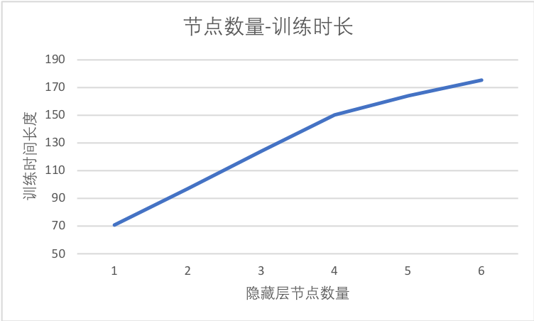

# 实验四 Neural Networks and Back Propagation
>实验者:timfan  
>[报告地址](https://github.com/timfaner/2018_PR_Experiment/blob/master/report/exp_4.md) : (https://github.com/timfaner/2018_PR_Experiment/blob/master/report/exp_2.md)
>代码地址 : [Github](https://github.com/timfaner/2018_PR_Experiment/tree/master/exp_4)

## 实验原理

## 实验目标

### 1.1 构建一层隐藏层的神经网络
使用类定义神经网络
#### 数据处理
给定数据集为非数值的，将该数据集转化为数值的数据集，同时剔除丢失部分属性的数据：  

```python
def line_process(input):
    case = [-1 for i in range(len(input) - 1)]
    label = [0] if input[-1] == 'no' else [1]
    base = (('no-recurrence-events', 'recurrence-events'),\
            ('10-19', '20-29', ... '70-79', '80-89', '90-99'),
            ('lt40', 'ge40', 'premeno'),
            ('0-4', '5-9', ...'40-44','45-49', '50-54', '55-59'),
            ('0-2', '3-5', ...'24-26','27-29', '30-32', '33-35', '36-39'),
            ('yes', 'no'),('1','2','3'),
            ('left','right'),
            ('left_up', 'left_low', 'right_up','right_low', 'central'))
    for index,t in enumerate(input[:-1]):
        for num,content in enumerate(base[index]):
            if content == t:case[index]=num
    #remove lost data
    for i in case:
        if i <0:
            return 0,0
```

#### 构建网络
分别用三个列表维护输入层，隐藏层，输出层。并用两个二维列表维护输入、输出权重。并随机填充0-1的数值。

```python
def setup(self, ni, nh, no):
    self.input_n = ni + 1
    self.hidden_n = nh
    self.output_n = no
    # init cells
    self.input_cells = [1.0] * self.input_n
    self.hidden_cells = [1.0] * self.hidden_n
    self.output_cells = [1.0] * self.output_n
    # init weights
    self.input_weights = make_matrix(self.input_n, self.hidden_n)
    self.output_weights = make_matrix(self.hidden_n, self.output_n)
    # random activate
    for i in range(self.input_n):
        for h in range(self.hidden_n):
            self.input_weights[i][h] = rand(-0.2, 0.2)
    for h in range(self.hidden_n):
        for o in range(self.output_n):
            self.output_weights[h][o] = rand(-2.0, 2.0)
    # init correction matrix
    self.input_correction = make_matrix(self.input_n, self.hidden_n)
    self.output_correction = make_matrix(self.hidden_n, self.output_n)
```
        
#### 前向传递
从`输入层 -> 隐藏层 -> 输出层` 依次激活神经元。激活函数为`sigmoid`函数。

```python
def predict(self, inputs):
    # activate input layer
    for i in range(self.input_n - 1):
        self.input_cells[i] = inputs[i]
    # activate hidden layer
    for j in range(self.hidden_n):
        total = 0.0
        for i in range(self.input_n):
            total += self.input_cells[i] * self.input_weights[i][j]
        self.hidden_cells[j] = sigmoid(total)
    # activate output layer
    for k in range(self.output_n):
        total = 0.0
        for j in range(self.hidden_n):
            total += self.hidden_cells[j] * self.output_weights[j][k]
        self.output_cells[k] = sigmoid(total)
    return self.output_cells[:]
```
#### 反向传播
根据反向传播公式，从输出层开始计算损失梯度

```python
def back_propagate(self, case, label, learn, correct):
    # feed forward
    self.predict(case)
    # get output layer error
    output_deltas = [0.0] * self.output_n
    for o in range(self.output_n):
        error = label[o] - self.output_cells[o]
        output_deltas[o] = sigmoid_derivative(self.output_cells[o]) * error
    # get hidden layer error
    hidden_deltas = [0.0] * self.hidden_n
    for h in range(self.hidden_n):
        error = 0.0
        for o in range(self.output_n):
            error += output_deltas[o] * self.output_weights[h][o]
        hidden_deltas[h] = sigmoid_derivative(self.hidden_cells[h]) * error
```  
得到各层各权重梯度后，得到更新权重。$W_{i+1} = W_{i} - \eta \times \partial{w}\div\partial{W_{i}} $  
但是为了更快的训练, 加入矫正项$W_{i+1} = W_{i} - \eta \times \partial{w}\div\partial{W_{i}} +\mu\times C$ 
其中 $ \mu$ 为矫正率

```python
    # update output weights
    for h in range(self.hidden_n):
        for o in range(self.output_n):
            change = output_deltas[o] * self.hidden_cells[h]
            self.output_weights[h][o] += learn * change + correct * self.output_correction[h][o]
            self.output_correction[h][o] = change
    # update input weights
    for i in range(self.input_n):
        for h in range(self.hidden_n):
            change = hidden_deltas[h] * self.input_cells[i]
            self.input_weights[i][h] += learn * change + correct * self.input_correction[i][h]
            self.input_correction[i][h] = change
    # get global error
    error = 0.0
    for o in range(len(label)):
        error += 0.5 * (label[o] - self.output_cells[o]) ** 2
    return error
```

#### 迭代训练网络  
```python
def train(self, cases, labels, limit=10000,\
 learn=0.05, correct=0.1):
    for j in range(limit):
        error = 0.0
        for i in range(len(cases)):
            label = labels[i]
            case = cases[i]
            error += self.back_propagate(case, label, learn, correct)
    return error
```
反向传播迭代训练次数，并输出最终错误率。

#### 实验现象

实例化一个网络，并设定隐藏层有五个神经元。$ \eta = 0.1, \mu = 0.1,迭代10000次$  
输出训练后的`output`
结果为:


```shell 
[0.01667898388059977]
[0.008298269105607374]
[0.1624555613727707]
.
.
.
[0.16240127519865608]
[0.16245590235419205]
[1.7086556190856035e-07]
```


### 1.2 对比NN与感知器
####
####

### 1.3 改变参数对NN表现的影响
 实例化多个网络，并设定隐藏层有五个神经元。设定$\mu = 0.1,迭代次数为100000 $  
 将学习率从0.1 - 0.9 等差排列并代入，并观察输出。  
 训练神经网络比较耗费时间，同时`Python GIL锁`的存在导致Python多线程效率较低,所以可以讲训练过程改成多进程训练,节约时间.  
 
```python
def newTrain(mtp,limit,learn,correct):
    print('NN_{} begin, learn={}, correct={}, limit = {}'.\
    format(mtp,learn,correct,limit))
    t = time.time()
    nn = BPNeuralNetwork()
    nn.setup(9, 2, 1)
    error = nn.train(data_set,labels,limit=limit,learn=learn,correct=correct)
    dt = round(time.time() - t,2)
    print('NN_{} done , spent {}s, with error {}'\
    .format(mtp,dt,round(error,4)))
for i in range(1,10):
    a = multiprocessing.Process(target=newTrain,args=(i,100000,i/10.0,0.1))
    a.start()
```
  
得倒结果：  

```shell
NN_1 begin, learn=0.1, correct=0.1, limit = 10000
NN_2 begin, learn=0.2, correct=0.1, limit = 10000
NN_4 begin, learn=0.4, correct=0.1, limit = 10000
NN_3 begin, learn=0.3, correct=0.1, limit = 10000
NN_5 begin, learn=0.5, correct=0.1, limit = 10000
NN_6 begin, learn=0.6, correct=0.1, limit = 10000
NN_7 begin, learn=0.7, correct=0.1, limit = 10000
NN_8 begin, learn=0.8, correct=0.1, limit = 10000
NN_9 begin, learn=0.9, correct=0.1, limit = 10000
NN_2 done , spent 990.19s, with error 12.5423
NN_3 done , spent 990.91s, with error 12.1209
NN_8 done , spent 990.99s, with error 16.0222
NN_1 done , spent 991.36s, with error 10.3207
NN_5 done , spent 991.41s, with error 14.3008
NN_4 done , spent 991.49s, with error 13.3184
NN_9 done , spent 991.52s, with error 17.9088
NN_7 done , spent 991.6s, with error 15.7346
NN_6 done , spent 991.7s, with error 14.3551
```
绘制图表：
  
由于迭代次数为终止条件,所以各个网络迭代时间相似。可以看到在相同迭代次数时候,学习率与错误率成正相关,我觉得这个说明迭代次数可能设置过小。

### 2.1隐含层数与节点数关系
隐含层越多,节点量越多,特征提取更多，准确率应该上升。而由于节点连接数量上升，效率必然下降。以下为隐含层为1层，隐含节点分别为2、4、6, $\mu = 0.1, \eta = 0.05，迭代100000 结果$


### 2.2 NN结构与人类神经网络的关联

我认为生物神经网络工作类似于NN，但不完全相同，理由如下:  

- 首先结构上两者类似，但NN是全连接并且分层，生物神经元更像每层之间能跨层链接，并且不是全连接的
- 其次是激活与训练过程类似 NN用权重，激活函数。人类神经网络通过多巴胺等激活链接类似于正权重，而用抑制型为副权重，而神经元中 电信号 ->化学信号 ->电信号 类似非线性的激活函数
- 训练过程 NN使用BP，而人类神经网络有一套激励惩罚机制，类似BP。
- 综上结构、输入输出相同，工作过程也用该类似。当然人类神经系统会复杂很多很多。

###  2.3 Autoencoder实现
#### 数据生成
输入输出使用randint生成即可

```python
dataset = [[random.randint(0,1) for r in range(3)] for i in range(20)]
labels = dataset.copy()
```

#### 实例化autoencoder  并训练
```python
autoencoder = nn_base.NN()
autoencoder.setup(len(dataset),2,en(labels))
autoencoder.train(dataset,labels,learn = 0.1,correct=0.1,limit=50000)
```

结果为  

输入：

```
dateset = [[1, 1, 0], [1, 1, 1], [1, 1, 1], 
[0, 0, 1], [0, 0, 1], [0, 1, 0], [0, 1, 1], 
[0, 1, 1], [1, 0, 1], [1, 1, 0], [0, 0, 1], 
[0, 1, 1], [0, 1, 0], [0, 0, 0], [0, 1, 0],
[0, 1, 1], [0, 1, 1], [0, 1, 0], [1, 1, 0], 
[1, 1, 0]]
```

输出：

```
[0.9999999844451946, 0.9999999999999998, 0.011340939866792377]
[0.8063188150891546, 0.9485531566347161, 0.41208355219484033]
[0.8063188150891546, 0.9485531566347161, 0.41208355219484033]
[1.8908913434534866e-17, 1.3015574827467521e-05, 0.9841696169773305]
[1.8908913434534866e-17, 1.3015574827467521e-05, 0.9841696169773305]
[0.03076969504417447, 0.9999999999999676, 0.09722546081687156]
[9.691306503191688e-15, 0.9720356286919296, 0.91753532238573]
[9.691306503191688e-15, 0.9720356286919296, 0.91753532238573]
[0.4998671199165, 0.49996186469574944, 0.5000141959647214]
[0.9999999844451946, 0.9999999999999998, 0.011340939866792377]
[1.8908913434534866e-17, 1.3015574827467521e-05, 0.9841696169773305]
[9.691306503191688e-15, 0.9720356286919296, 0.91753532238573]
[0.03076969504417447, 0.9999999999999676, 0.09722546081687156]
[0.026511879689829047, 0.26060645183848347, 0.5952365012087047]
[0.03076969504417447, 0.9999999999999676, 0.09722546081687156]
[9.691306503191688e-15, 0.9720356286919296, 0.91753532238573]
[9.691306503191688e-15, 0.9720356286919296, 0.91753532238573]
[0.03076969504417447, 0.9999999999999676, 0.09722546081687156]
[0.9999999844451946, 0.9999999999999998, 0.011340939866792377]
[0.9999999844451946, 0.9999999999999998, 0.011340939866792377]
```
### 2.4 hidden node 与表现关系
仿照1.3

```python
def newTrain(mtp,node_count):
    print('NN_{} begin, hidden node count = {}'.\
    format(mtp,node_count))
    t = time.time()
    nn = nn_base.BPNeuralNetwork()
    nn.setup(len(dataset),node_count,len(labels))
    error = nn.train(dataset,labels,limit=50000,learn=0.05,correct=0.1)
    dt = round(time.time() - t,2)
    print('NN_{} done , spent {}s, with error {}'\
    .format(mtp,dt,round(error,4)))

for i in range(1,5):
    a = multiprocessing.Process(target=newTrain,args=(i,i))
    a.start()
``` 
 
 结果为
 
```
NN_1 begin, hidden node count = 1
NN_2 begin, hidden node count = 2
NN_3 begin, hidden node count = 3
NN_4 begin, hidden node count = 4
NN_5 begin, hidden node count = 5
NN_6 begin, hidden node count = 6
NN_1 done , spent 71.72s, with error 4.7513
NN_2 done , spent 97.81s, with error 1.0128
NN_3 done , spent 124.01s, with error 0.0011
NN_4 done , spent 149.37s, with error 0.0004
NN_5 done , spent 164.14s, with error 0.0004
NN_6 done , spent 175.56s, with error 0.0004
```

可以看到，hidden node数量与时间呈正相关 与 训练精度呈负相关，训练时间与时长基本呈线性，错误率大大下降.所以可以提高中间层节点数量可以大大提高准确性.
  
  
